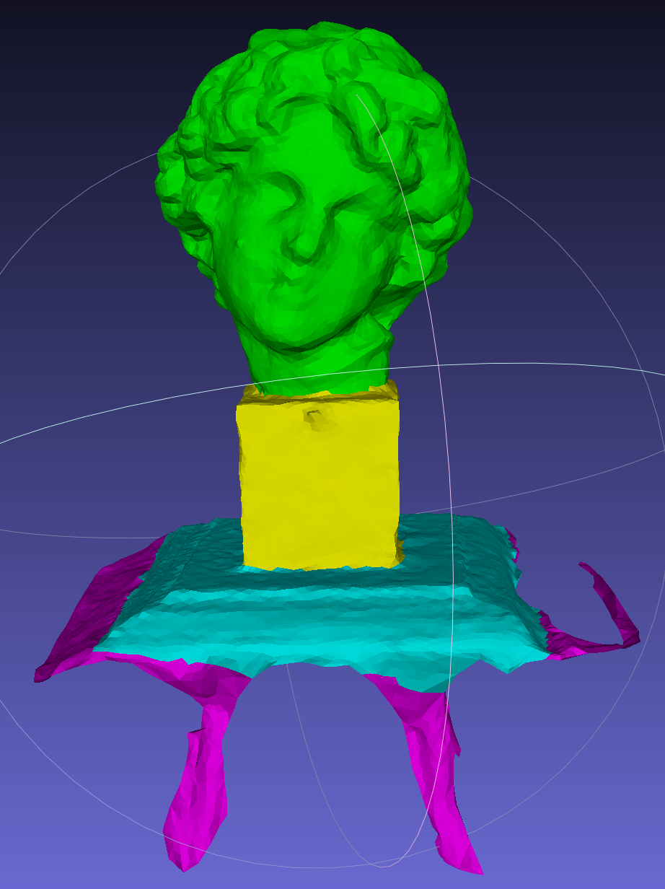
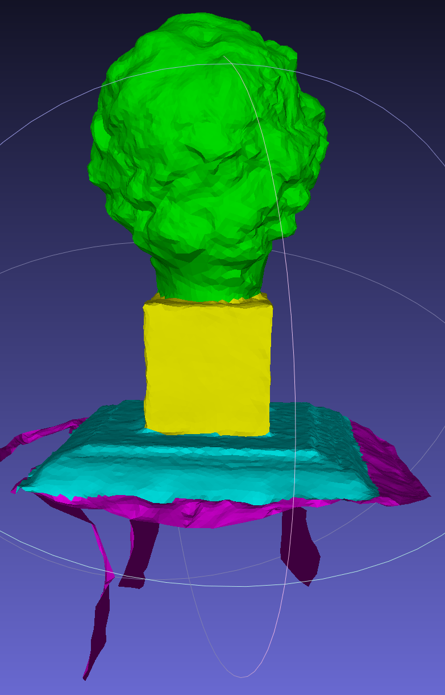

# Semantic-Labeling-of-3D-Model
implement of Fine-Level Semantic Labeling of Large-Scale 3D Model by Active Learning(part) 
> Input :
MESH(obj, stl, off, ply) MVE_SCENE LABEL_IMAGE_NAME 
>OUTPUT:
obj mtl

example
INPUT:

OUTPUT:

